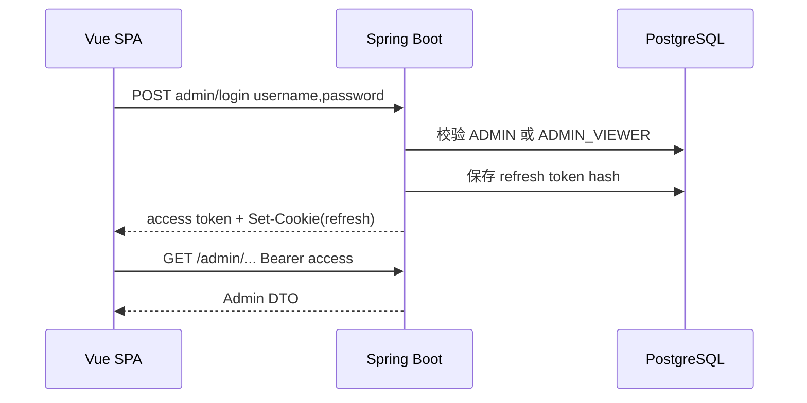
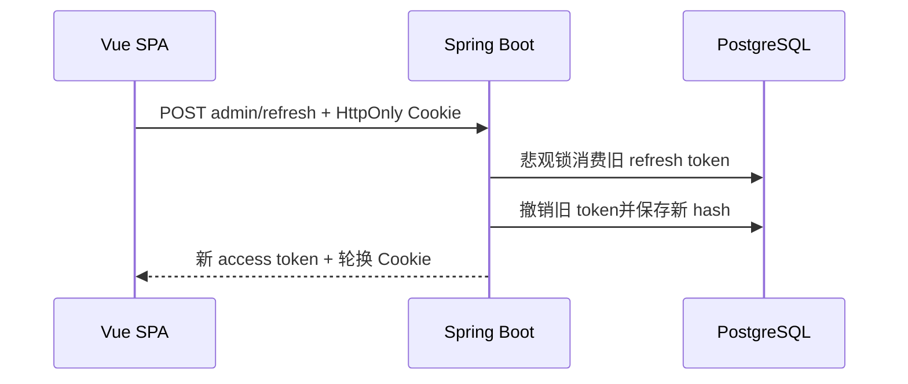

# 后端契约与安全基线设计

## 1. 改动边界

本任务只修改：

- `services/backend/` 的认证、授权、测试、配置和必要 migration；
- `contracts/openapi/` 的契约快照；
- `infra/.env.example`、本地 Compose 和验证工具中的配置契约；
- 与新行为直接相关的 `.trellis/spec/backend/` 规范。

不创建 `apps/admin-web/`，不修改 Android 业务代码。

## 2. 测试基线

将当前单个 `BackendIntegrationTest` 拆为共享容器基类和分领域测试：

```text
src/test/java/.../backend/
├── support/BackendIntegrationSupport.java
├── auth/AuthHttpIntegrationTest.java
├── user/UserPreferencesIntegrationTest.java
├── vehicle/VehicleStateIntegrationTest.java
├── service/ServiceOperationsIntegrationTest.java
├── content/DiscoveryContentIntegrationTest.java
├── media/MediaIntegrationTest.java
└── contract/OpenApiContractTest.java
```

- PostgreSQL 容器在测试 JVM 内共享，测试数据通过随机用户名/UUID 隔离。
- MinIO 使用 Testcontainers `GenericContainer`，测试 bucket 私有、上传、预签名、删除和故障映射。
- 容器不可用时开发者可看到明确跳过原因；统一质量门在 Docker 可用环境断言关键容器测试确实执行。
- 每个 HTTP 测试同时断言 status、content type、稳定 `code` 和关键字段，不只断言状态码。

## 3. OpenAPI 快照

- Springdoc 运行时文档是源，仓库保存规范化后的 `contracts/openapi/openapi.json`。
- `OpenApiContractTest` 获取 `/v3/api-docs`，移除非确定字段并按 key 排序后与快照比较。
- 显式更新命令只在维护者设置更新开关时重写快照；普通 `test` 只比较，不修改工作树。
- 后续 Admin 根据该快照生成 TypeScript 类型；Android 使用该快照维护 JSON fixture。

## 4. 角色与授权

新增角色：

```text
USER          Android 用户域
ADMIN_VIEWER  Admin 只读演示
ADMIN         Admin 完整权限
```

- 新 Flyway migration 扩展 `users.role` CHECK，保留现有值。
- JWT 继续携带单个 `role` claim，并映射为 `ROLE_<ROLE>`。
- `GET /api/v1/admin/**` 允许 `ADMIN_VIEWER` 和 `ADMIN`。
- POST/PUT/PATCH/DELETE Admin 路由只允许 `ADMIN`。
- Controller 使用 method security 标注读写意图，SecurityFilterChain 同时提供 URL 级默认拒绝，形成纵深防御。
- Viewer 初始化器读取独立环境变量，幂等创建但不覆盖已存在用户密码或角色。

## 5. 双客户端认证

### Android 兼容接口

现有 `/api/v1/auth/register|login|refresh|logout` 保持请求和响应不变，refresh token 继续由 Android Keystore-backed store 保存。

### Web Admin 接口

```text
POST /api/v1/auth/admin/login
POST /api/v1/auth/admin/refresh
POST /api/v1/auth/admin/logout
```

- login 复用 `AuthService` 校验，只接受 `ADMIN`/`ADMIN_VIEWER`。
- login/refresh 响应只含 `accessToken`、`accessExpiresAt` 和 `user`。
- refresh token 写入 Cookie：`HttpOnly`、配置化 `Secure`、`SameSite=Strict`、Path 限制到 Admin auth 路径。
- refresh 读取 Cookie 并执行现有悲观锁轮换；响应设置新 Cookie。
- logout 即使 token 已失效也清理 Cookie；有效 token 同时在数据库撤销。
- Admin SPA 与 API 在生产同源；开发环境由 Vite proxy 转发 `/api`，不新增 `*` CORS。

## 6. 限流与生产配置保护

- 单后端实例使用进程内 token bucket；key 采用规范化客户端 IP（仅信任配置的反向代理头）或已认证 user subject。
- 登录/refresh 的限制独立于媒体上传，避免大文件占用和口令爆破。
- 触发限制返回 `429 RATE_LIMITED`，带合理 `Retry-After`，不暴露账户是否存在。
- production profile 启动守卫验证 JWT secret、Admin/Viewer 密码、Secure Cookie 和公开 endpoint；开发 profile 保留本地便利默认值。
- 限流为单实例基线；若未来横向扩容，再以 Redis/网关限流替换，不在本任务提前引入分布式组件。

## 7. 数据流

### Web 登录



### Web refresh



## 8. 失败契约

| 场景 | HTTP / code |
| --- | --- |
| Web 登录普通 USER | `403 ADMIN_ACCESS_REQUIRED` |
| 缺失或无效 refresh Cookie | `401 INVALID_REFRESH_TOKEN` |
| Viewer 写 Admin API | `403` |
| 登录/refresh/上传超过限制 | `429 RATE_LIMITED` |
| production 配置不安全 | 应用拒绝启动，不对外提供服务 |
| 对象存储不可用 | `503 MEDIA_STORAGE_UNAVAILABLE` |

## 9. 兼容与回滚

- 先增加 migration 与新端点，不删除旧接口；Android 不需要同步发布。
- migration 只扩展角色集合，旧版本应用读取 `USER`/`ADMIN` 不受影响。
- 新代码部署失败可回滚到旧镜像；数据库保留额外允许值不会影响旧代码，前提是回滚期间不创建 Viewer。部署顺序先 migration/新代码，再创建 Viewer。
- OpenAPI 快照变更必须与代码同一提交，便于定位客户端契约变化。
