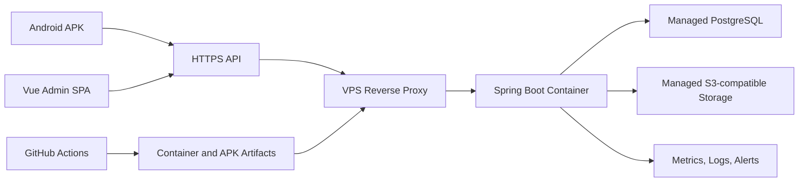

# PhoneCar 生产级全栈简历项目设计

## 1. 目标与边界

PhoneCar 的目标不是承载真实车控业务，而是形成一套可运行、可测试、可部署、可观测、可解释的全栈工程样板。项目应从代码、在线 Admin、Android APK、CI 记录和必要工程文档体现以下能力：

- Vue/TypeScript 前端工程与权限控制；
- Spring Boot API、认证授权、事务、数据库迁移和对象存储；
- Android 客户端、缓存和服务端同步；
- OpenAPI 契约、跨端自动化测试和端到端测试；
- 容器化、CI/CD、HTTPS、监控、备份恢复和安全基线。

不实现真实车控、支付、定位、蓝牙、商业客服、邀请码或应用商店审核。

## 2. 当前能力矩阵

| 能力 | 当前状态 | 证据 | 主要缺口 |
| --- | --- | --- | --- |
| Android 原型 UI | 已实现 | 16 个页面、5 个设备测试通过 | 测试使用内存 Store，未覆盖真实认证和网络 |
| 认证与会话 | 基础可用 | 实测 Android 注册成功；refresh token 轮换测试 | 断网恢复会清会话；浏览器安全会话未设计；无登录限流 |
| 车辆状态同步 | 基础闭环 | 实测解锁后 PostgreSQL version 由 0 变 1 | 缺少远端 Repository 失败、冲突、重试自动化测试 |
| 预约/维保/订阅 | 后端接口存在，Android 部分接入 | POST/GET/PUT/DELETE Controller | Android 不读取预约历史；确认状态在刷新后丢失；缺少防重复提交 |
| 发现内容与媒体 | 后端能力存在，Android 部分展示 | Admin API、MinIO、预签名 URL、Coil | 关注 API 未接 UI；媒体与内容生命周期缺少完整测试 |
| Web Admin | 未实现 | 管理员目前只通过 Swagger 操作 | 缺少 Vue 前端、只读演示角色、浏览器认证、前端测试 |
| 后端测试 | 少量集成测试通过 | 3 个 `BackendIntegrationTest` 测试方法 | 未覆盖大部分领域、MinIO、RBAC 边界和恢复场景 |
| 交付 | 本地构建可用 | Android/Backend/Compose 统一验证通过 | 无 CI、制品仓库、签名 Release、自动部署和回滚 |
| 运维 | 本地 Compose 可用 | PostgreSQL、MinIO、Backend healthy | 无公网 TLS、托管数据服务、指标、日志聚合、告警和恢复演练 |

## 3. 目标仓库结构

```text
apps/
├── android/                 # 现有 Kotlin/Compose 客户端
└── admin-web/               # Vue 3 + TypeScript + Vite SPA
services/
└── backend/                 # Spring Boot 唯一业务后端
infra/
├── local/                   # 本地 PostgreSQL + MinIO + Backend + Admin
└── production/              # VPS 反向代理、容器和部署模板
contracts/
└── openapi/                 # 可评审、可检测漂移的 OpenAPI 快照
tools/                       # 跨工程验证、演示数据和部署检查脚本
.github/workflows/           # PR 门禁、制品发布和生产部署
```

Android、Admin 和 Backend 保持独立构建。仓库根只负责编排，不建立跨工程 Gradle 依赖。

## 4. 目标运行架构



- Admin 静态资源与 `/api` 由同一域名的反向代理提供，避免宽泛 CORS。
- 后端容器无本地持久化状态；数据库和对象存储使用托管服务。
- 首期单 VPS 足够，不引入 Kubernetes；可通过替换镜像和健康检查回滚。

## 5. API 与认证边界

### 5.1 契约

- Spring Boot 是 OpenAPI 唯一事实来源，CI 导出 `contracts/openapi/openapi.json` 并检测未提交漂移。
- Admin 根据 OpenAPI 生成 TypeScript 类型；业务请求封装保持薄层，不手写重复 DTO。
- Android 保留 Kotlin DTO，但增加服务端响应 fixture 与序列化契约测试。
- 错误继续使用 Problem Details 和稳定 `code`；客户端不得通过 HTTP 文案判断业务错误。

### 5.2 角色

- `USER`：Android 普通用户域接口。
- `ADMIN_VIEWER`：公开演示账号，只能读取 Admin 内容、媒体和健康摘要。
- `ADMIN`：项目维护者，允许上传、编辑、发布、下架和删除。
- 后端按 HTTP method 和明确 authority 限制写接口，不能只在前端隐藏按钮。

### 5.3 Web 会话

- Android 继续使用短期 access token + Keystore 加密 refresh token。
- Admin access token 仅保存在内存；refresh token 使用 `HttpOnly + Secure + SameSite` Cookie。
- Web refresh/logout 由专用端点处理；不把 refresh token 写入 LocalStorage、Pinia 持久化或日志。
- 登录、注册、refresh 和上传接口加入限流；生产 profile 禁止弱默认 secret 启动。

## 6. 业务闭环

### Android

- 把本地 UI 状态、用户级缓存和服务端确认状态明确分开。
- 离线启动允许读取最近缓存，但明确显示离线/过期状态；网络失败不能误清有效 refresh token。
- 预约和维保使用服务端记录作为确认来源，支持历史读取和重复提交保护。
- 发现内容关注使用真实 content ID 调用后端，失败时保持服务端确认状态。
- 车辆、偏好、订阅、内容按领域独立加载和重试，避免一个接口失败阻断全部刷新。

### Admin

- 登录、退出和会话恢复；路由守卫和 401/403 处理。
- Dashboard 展示服务状态和只读摘要，不暴露敏感 Actuator 数据。
- 媒体上传、列表和删除；展示上传进度、校验错误和引用冲突。
- 内容列表、筛选、创建、编辑、发布、下架和删除。
- `ADMIN_VIEWER` 显示只读状态，所有写控件禁用；后端仍做最终授权。

## 7. 数据、演示与恢复

- Flyway migration 只新增、不改写；部署前运行从空库迁移测试。
- 演示管理员凭据由生产 secret 注入，公开只读账号由幂等 seed 创建。
- 公开账号不能写；Android 演示账号使用独立数据并每日恢复到固定快照。
- 托管 PostgreSQL 开启自动备份和时间点恢复；对象存储开启版本或生命周期策略。
- 至少完成一次“新数据库恢复 + Flyway validate + API smoke test”演练并记录耗时。

## 8. 可观测性与安全

- Backend 输出结构化 JSON 日志，包含 request/trace ID，不记录密码、token、Cookie、对象签名 URL。
- Actuator 只公开 health；指标端点由网络或认证保护，采集 JVM、HTTP、连接池和自定义业务指标。
- 配置 uptime、5xx、延迟、数据库连接和磁盘/容器异常告警。
- Admin 配置全局错误边界、前端错误上报和 API correlation ID 展示。
- Android 配置崩溃上报的可替换接口；公开仓库不提交供应商密钥。
- CI 执行依赖审计、secret scan、容器镜像扫描和 SBOM 生成。
- 反向代理启用 TLS、安全响应头、请求体限制和基础速率限制。

## 9. 测试策略

| 层级 | 目标 |
| --- | --- |
| Backend 单元/切片 | 校验领域规则、错误码、分页、权限和验证 |
| Backend 集成 | Testcontainers PostgreSQL + S3/MinIO，覆盖 migration、事务、媒体补偿和 RBAC |
| Admin 单元/组件 | Vitest + Vue Testing Library，覆盖表单、权限、错误和 loading 状态 |
| Admin API 模拟 | MSW 覆盖 Problem Details、401/403/409/503 和分页 |
| Web E2E | Playwright 在本地 Compose 上覆盖登录、上传、发布、只读账号和退出 |
| Android JVM | MockWebServer 覆盖缓存、离线启动、401 单飞刷新、409、失败回滚和各领域同步 |
| Android 设备 | 保留 16 页面测试，新增真实 Activity + 测试后端核心路径 |
| 契约 | OpenAPI 漂移、TypeScript 类型生成、Android JSON fixture |
| 部署 smoke | health、登录、只读查询、静态资源、TLS 和数据库 migration |

## 10. 任务拆分与依赖

当前任务作为路线图父任务，不直接承载业务实现。批准后创建以下可独立验收的子任务：

1. **后端契约与安全基线**：先建立现有 API 的测试和 OpenAPI 基线，再增加 Web 会话与只读角色。
2. **Vue Admin MVP**：依赖任务 1 的稳定契约，实现登录、媒体和内容管理。
3. **Android 服务端闭环**：可与任务 2 部分并行，但依赖任务 1 的契约基线。
4. **跨端端到端测试**：依赖 2、3 的核心流程完成。
5. **CI/CD 与生产部署**：可先搭建 PR 门禁；正式部署依赖 1、2 的健康检查和制品。
6. **可观测性、恢复与安全收口**：依赖生产拓扑确定并可与 4、5 联动。

## 11. 关键取舍

- 选择 Vue SPA 而不是 SSR/BFF：边界清晰，直接展示前后端分离，SEO 对 Admin 无价值。
- 选择单 VPS 而不是 Kubernetes：保留真实部署、回滚和监控能力，避免为简历堆叠无业务必要的集群复杂度。
- 使用托管数据库/对象存储：把练习重点放在应用交付和恢复契约，不把单机数据风险伪装成生产化。
- 公开账号只读：面试官可直接体验，同时避免定时清理成为主要安全控制。
- 先补契约和测试，再开发 Admin：避免新客户端建立在未覆盖的 API 行为上。
- 不设置独立的简历包装阶段；必要文档随对应工程任务同步完成。
