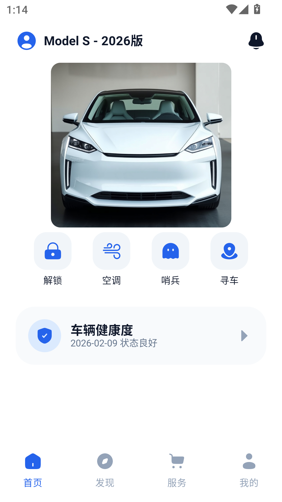
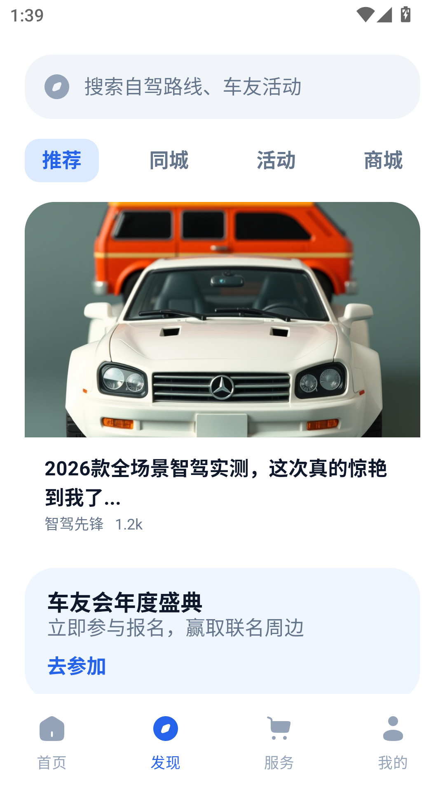
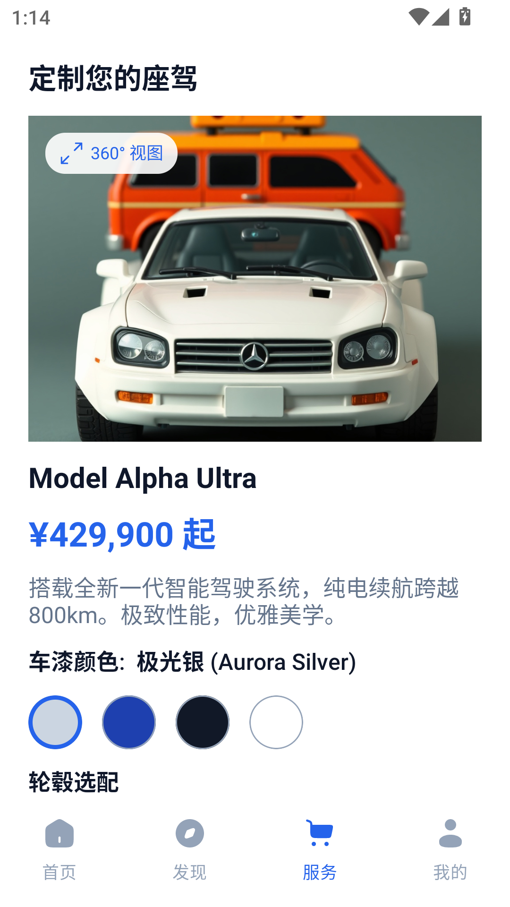
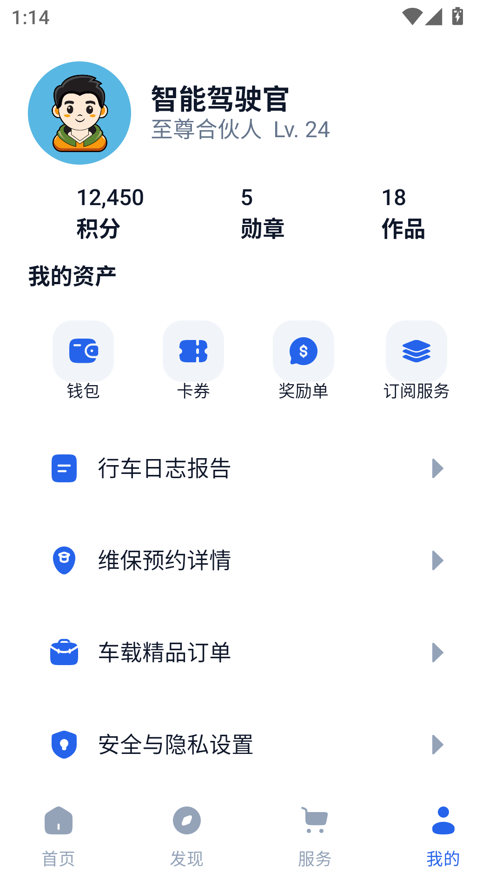

# DrivePilot Android

[English](README.md) · **简体中文**

这是一个使用 Kotlin、Jetpack Compose 与 Spring Boot 构建的智能车控 APP 原型。仓库采用单仓库、双独立工程结构：Android 与后端拥有各自的 Gradle Wrapper、依赖目录和构建生命周期，只通过 `/api/v1` HTTP/JSON 协作。

> 本项目仅用于界面与交互演示，不会连接真实车辆，也不会执行真实支付、导航、蓝牙、相机、定位或远程车控操作。

## 界面截图

<table>
  <tr>
    <th>首页</th>
    <th>发现</th>
    <th>服务</th>
    <th>我的</th>
  </tr>
  <tr>
    <td></td>
    <td></td>
    <td></td>
    <td></td>
  </tr>
</table>

截图来自 MuMu Android 12 模拟器，原始分辨率为 1080 × 1920。

## 主要功能

- **车辆首页：** 车辆解锁、智能座舱、哨兵模式、车体控制、充电地图和数字钥匙。
- **发现：** 汽车生活内容、智能驾驶介绍和官方直播。
- **服务：** 在线选车、维保预约、道路救援和软件订阅。
- **我的：** 个人中心、行车报告、服务入口、账户安全和隐私设置。
- **16 个可达页面：** 所有原型目标页均通过 Navigation Compose 连通。
- **账号与同步：** 支持注册、登录、退出、令牌刷新，以及断网读取最近一次成功缓存。
- **图片内容管理：** 管理员通过 Swagger 上传图片和发布发现内容；图片存放在私有 MinIO 桶并通过短期预签名 URL 读取。
- **高保真原型资源：** 使用本地 Solar 矢量路径和原型图片，不以近似 Material 图标替代。

## 技术栈

| 模块 | 技术 |
| --- | --- |
| Android | Kotlin 2.3.21、Jetpack Compose、Material 3、Navigation Compose |
| 状态与持久化 | ViewModel、Kotlin Flow、Preferences DataStore 1.2.1 |
| 网络与图片 | Retrofit 3、OkHttp 5、Kotlinx Serialization、Coil 3 |
| Android 测试 | JUnit 4、Compose UI Test、AndroidX Test |
| Android 版本 | minSdk 24，targetSdk 36 |
| 后端 | Java 21、Spring Boot 4.1、PostgreSQL 16、Flyway、MinIO |

## 仓库结构

```text
apps/android/                    # 独立 Android Gradle 工程
├── app/src/main/java/com/lautung/phonecar/
│   ├── data/                    # auth、local、model、remote、repository
│   └── ui/                      # components、navigation、screens、theme
├── gradle/libs.versions.toml    # Android 专用依赖
├── settings.gradle.kts         # 仅包含 :app
└── gradlew.bat

services/backend/                # 独立 Spring Boot Gradle 工程
├── src/main/java/.../backend/   # auth、vehicle、user、service、content、media
├── src/main/resources/db/migration/
├── gradle/libs.versions.toml    # 后端专用依赖
├── Dockerfile
└── gradlew.bat

infra/                           # Docker Compose 与环境变量示例
docs/                            # 截图、原型和设计文档
tools/                           # 仓库级 PowerShell 工具
```

服务端业务状态是登录用户的权威来源；DataStore 保存最近成功状态及设备本地 UI 状态。所有写操作要求联网，失败时保留最近一次服务端确认状态。

## 环境要求

- PowerShell 7（Windows 环境优先）
- Android Studio、Android SDK 36，以及 Android 7.0（API 24）或更高版本设备
- Java 21、Docker Desktop 与 Docker Compose
- Android 和后端各自使用目录内的 Gradle Wrapper；macOS/Linux 将 `gradlew.bat` 替换为 `./gradlew`

## 启动本地后端

复制环境变量示例并替换数据库密码、JWT secret、管理员密码、只读演示账号密码和 MinIO secret：

```powershell
Copy-Item infra/.env.example infra/.env
docker compose --env-file infra/.env -f infra/docker-compose.yml up --build -d
docker compose --env-file infra/.env -f infra/docker-compose.yml ps
```

- 健康检查：`http://localhost:8080/actuator/health`
- Swagger UI：`http://localhost:8080/swagger-ui.html`
- OpenAPI：`http://localhost:8080/v3/api-docs`
- MinIO Console：`http://localhost:9001`

模拟器默认访问 `http://10.0.2.2:8080/api/v1/`。真机或其他网络环境可在构建时覆盖：

```powershell
Set-Location apps/android
.\gradlew.bat assembleDebug -PPHONECAR_API_BASE_URL=http://192.168.1.10:8080/api/v1/
```

管理员由 `ADMIN_USERNAME`/`ADMIN_PASSWORD` 初始化，只读 Admin 演示账号由 `VIEWER_USERNAME`/`VIEWER_PASSWORD` 初始化。普通注册只能创建 `USER`。Android 保持 JSON refresh token 契约，后续 Web Admin 使用 `/api/v1/auth/admin/*` 和 HttpOnly refresh Cookie。MinIO 凭证不会下发到客户端；`prod` profile 会拒绝开发默认 secret、不安全 Cookie 和非 HTTPS 公共媒体地址。

## 构建与安装 Android

运行程序或设备测试前先执行 `adb devices`。如果已有可用模拟器则直接使用，没有时才创建或启动 AVD。

```powershell
Set-Location apps/android
.\gradlew.bat assembleDebug
adb install -r app\build\outputs\apk\debug\app-debug.apk
```

APK 位于 `apps/android/app/build/outputs/apk/debug/app-debug.apk`。

## 独立构建后端

```powershell
Set-Location services/backend
.\gradlew.bat test bootJar
```

Jar 位于 `services/backend/build/libs/phonecar-backend.jar`。

## 验证命令

从仓库根运行统一验证：

```powershell
pwsh -File .\tools\verify-all.ps1
pwsh -File .\tools\verify-all.ps1 -IncludeDeviceTests
```

有意修改 API 后，必须显式评审并更新仓库中的 OpenAPI 快照：

```powershell
Push-Location services/backend
.\gradlew.bat '-Dphonecar.updateOpenApiSnapshot=true' test --tests '*OpenApiContractTest'
Pop-Location
```

也可以分别执行：

```powershell
Push-Location apps/android
.\gradlew.bat testDebugUnitTest lintDebug assembleDebug connectedDebugAndroidTest
Pop-Location

Push-Location services/backend
.\gradlew.bat test bootJar
Pop-Location

docker compose -f infra/docker-compose.yml config --quiet
```

设备 UI 测试会遍历全部 16 个原型页面，并验证四个主入口、返回栈、关键控件、确认弹窗和状态更新。

## 项目范围

- 仅支持手机竖屏布局，固定浅色主题，部分场景保留深色画面
- 后端只维护模拟车况和演示业务记录
- Android 不请求定位、相机、蓝牙、支付或真实车控权限
- 仅提供 Debug APK，不配置正式 Release 签名
- 不提交 `.env`、密钥、runtime、临时文件或构建产物

原始交互参考保存在 [`docs/prototype/智驾车控APP原型_v8.html`](docs/prototype/%E6%99%BA%E9%A9%BE%E8%BD%A6%E6%8E%A7APP%E5%8E%9F%E5%9E%8B_v8.html)。
